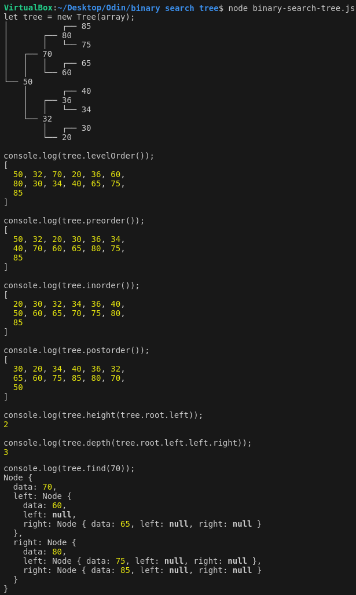
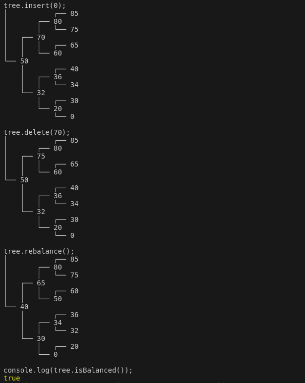

# Odin Project #15: Binary Search Trees

The goal of this Odin Project assignment was to create a Balanced Binary Search Tree with various functions listed below.

I started and finished this project in March 2023.

## Assignment

[The Odin Project - JavaScript - #15 Binary Search Trees](https://www.theodinproject.com/lessons/javascript-binary-search-trees)

## Technology

- Vanilla JavaScript

## Key Concepts

- Computer science
- Balanced Binary Search Trees
- Recursion

## Functions

- buildTree(array): takes an array of data and turns it into a balanced binary tree full of Node objects
- insert(value): inserts the given value
- delete(value): deletes the given value
- find(value): returns the node with the given value
- levelOrder: traverses the tree in breadth-first level order
- inOrder, preOrder, postOrder: each of these functions traverses the tree in their respective depth-first order
- height(node): returns the given node’s height (defined as the number of edges in the longest path from a given node to a leaf node)
- depth(node): returns the given node’s depth (defined as the number of edges in the path from a given node to the tree’s root node)
- isBalanced: checks if the tree is balanced (a balanced tree is one where the difference between heights of the left subtree and the right subtree of every node is not more than 1)
- rebalance: rebalances an unbalanced tree
- prettyPrint: console.logs the tree in a structured format

## Links

[My Other Projects](https://brightneon7631.github.io/odin-scrimba-projects/)

## Screenshots





## Deployment

```bash
# clone repo
git clone

# run script
node binary-search-tree.js
```
